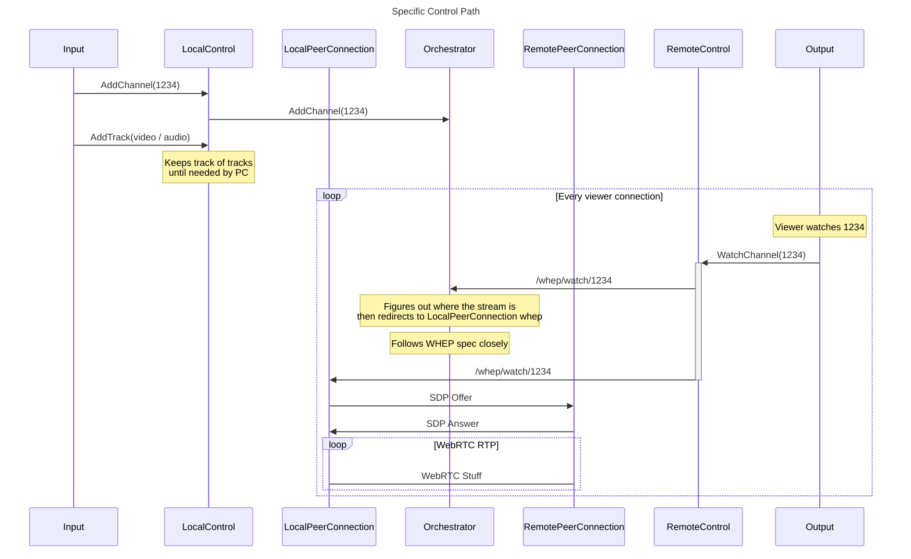
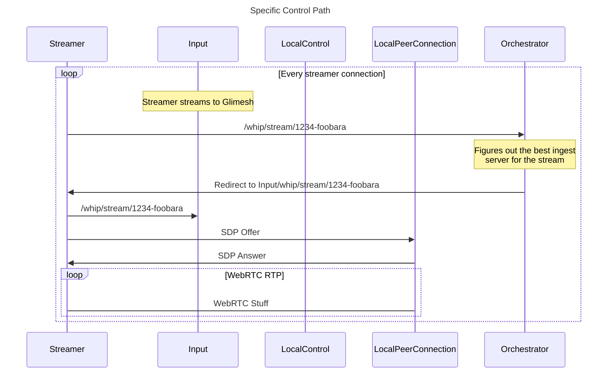
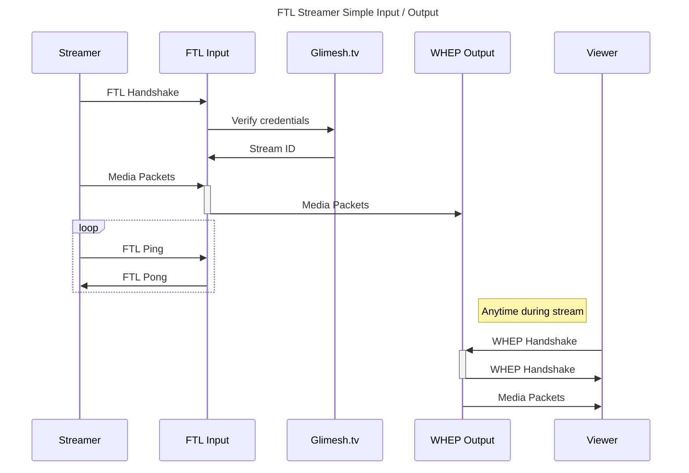
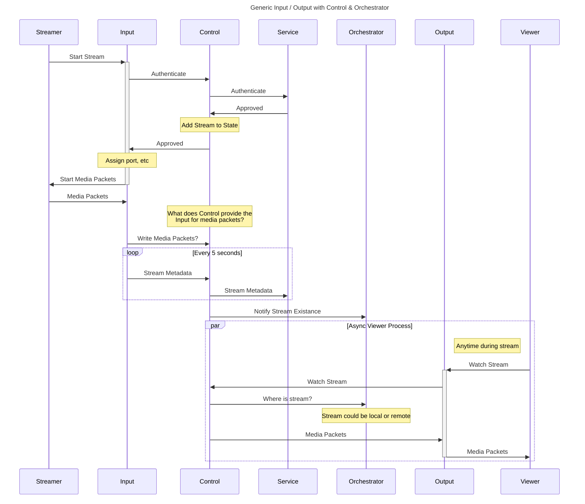
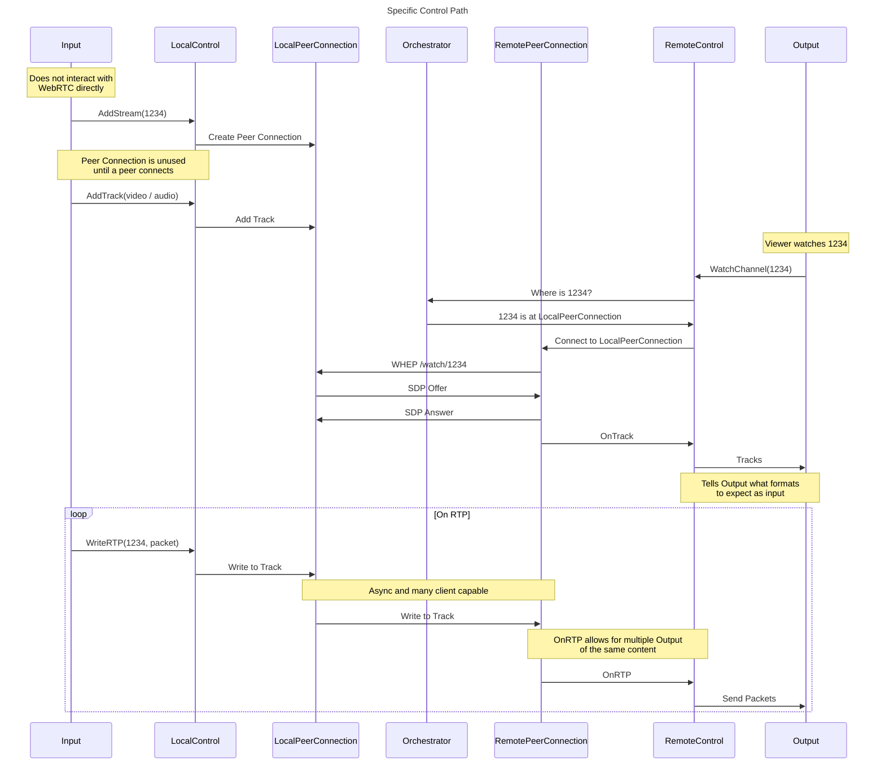

# Architecture
Waveguide under the hood is a interface layer for working with WebRTC.


# Protocols
Protocols are publicly available implementations of a specific technology usable for other projects.

Examples of protocols include: RTMP, SRT, FTL, WebRTC, HLS, etc

# Inputs
Inputs are Waveguide specific implementations of a specific protocol, either one maintained by us, or one maintained by 3rd parties. Inputs handle facilitation between Protocols and the Control.

Examples of inputs include: FTL, RTMP, etc

# Control
The Control is the middle piece between the ingests and waveguide. Control is responsible for authenticating new streams against a Service, managing a known state of those streams, and managing tracks.

# Outputs
Outputs are Waveguide specific implementations of a specific protocol, the same as inputs. They handle accepting incoming viewers, and fetching the media packets needed to serve up the stream to the user. A output can be as simple as a WebRTC video stream, or an output could save entire streams to a disk for later consumption. A user of an output can also be another Waveguide server that relays the video over WHEP.

Examples of outputs include: WHEP (WebRTC), HLS, etc

# Orchestrator 
The Orchestrator has been simplified and is now responsible for load balancing WHIP and WHEP users to servers that meet their latency or load needs. The Control only tells the Orchestrator where a stream is, and when the stream is done. 

## Improved design based on simple HTTP based Orchestrator with WHEP (and WHIP!)


### For WHIP (assuming WebRTC OBS)



## Historical Architecture Ideas




## Architecture Choices
### How do Media Packets make it from an Input to an Output on a local host?
Can we just have a list of writers that the Control should be responsible to writing to? Then they could be net.Conn or io.Writer for local.
```go
buf := new(bytes.Buffer)
conn, _ := net.Dial("udp", "127.0.0.1:1234")

manyWriters := [3]io.Writer{
    buf,
    os.Stdout,
    conn,
}

for _, writer := range manyWriters {
    writer.Write([]byte{1, 2, 3})
}
```

OR 

We use WebRTC all the way through, with the Inputs and Outputs speaking to each other via WebRTC.

